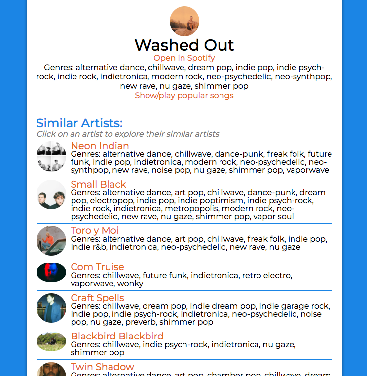

# Explore New Artists
Explore new artists and listen to their popular songs! 

See it live at https://exploreartists.surge.sh/

## Background
I built this app for a bi-weekly coding challenge in a Codecademy group I'm in and ended up really liking it. I love listening to music and like exploring new music but the only way I listen to new bands is on Pandora or Amazon music and the selection is getting a little stale. So I wanted a new way to find new bands. When a challenge came up with "music" as the prompt I decided to find a way to explore new artists.

## How It Works
Click the log in button and the app gets your permission to connect to your Spotify account then redirects back to the site. Enter an artist or song in the search bar and click the correct result and the app will show a list of 20 similar artists and their genres. Click another artist to keep exploring. The main artist you're searching will also inlcude a link to their Spotify page and you can even drop down a music player and hear their popular songs right in the app!

## Features
I built this app in React, which I love. The app gets all its data from the Spotify API using the Fetch API and logs in securely with OAuth. You can search by artist or song, the app will return results for both. The artist you searched for is prominently displayed at the top and includes a media player showing the artist's 10 most popular songs. The media player slides down and back up with CSS, staying out of the way if you're not using it. If you're on Chrome you can get full songs in the drop down media player, other browsers will show 30 second snippets (Spotify's restrictions, not mine). While you can get some of this information off Spotify it's not as detailed and not without ads and other visual clutter. I like searching up an artist and clicking through related artists for a while, listening to songs along the way, until I find a new artist I like. 

## To Do
* Hide player if a new artist is searched for 
* **Possible Features**
* Add suggestions to home page
* Clicking a genre on similar artist page looks up popular artists in that genre?
* Add section to footer to look up song by lyrics?
* Make two tabs for search page with artist and song results?